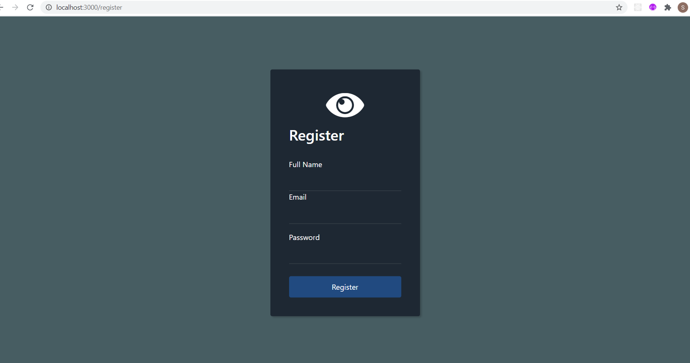
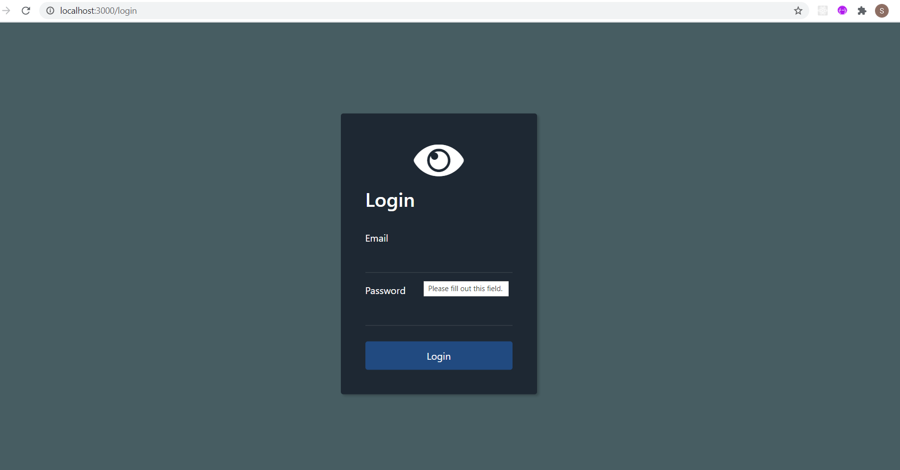

# Login and Signup system

A Authentication website using following technologies:
MongoDB-- for Database handling
bcrypt--bcrypt is a password-hashing. The system is added i.e. salting+hashing process to increse level of security. 
This is Level-4 authentication.
This system is designed in a way to prevent hackers to hack into our Database and if they hack they won't be able to crack users credential.

# Working
1.Its very simple first you have to Register in our database
2.with those credential you can easily Login.

# To open to your local system 
Install node_modules using express and run localhost:3000/

# Added Some Screenshots of the project

